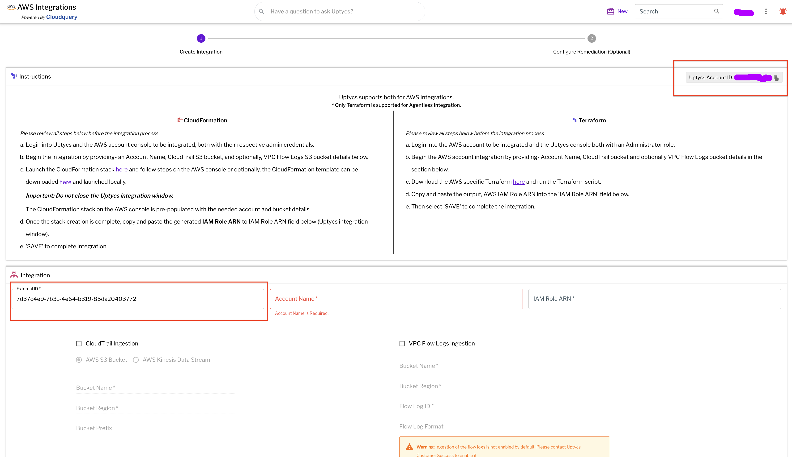

# Terraform AWS IAM role module

This module creates the necessary AWS IAM role and its applicable permissions policies. It will return the IAM role ARN which will be manually entered in the Uptycs console as part of the service integration process.
The following four permissions policies will be attached to this IAM role:

- AWS managed: arn:aws:iam::aws:policy/job-function/ViewOnlyAccess
- AWS managed: arn:aws:iam::aws:policy/SecurityAudit
- Customer managed:

  - arn:aws:iam::<Customer-Account-ID>:policy/cloudquery-ReadOnlyPolicy
  - arn:aws:iam::<Customer-Account-ID>:policy/cloudquery-cloudtrail-bucket-policy

&nbsp;
# Prerequisites

- The user must Install or update to v1.4.0 (latest version) of Terraform.
- The user must have `Git` installed on the system that they are using to execute the Terraform script.
  - Instructions on how to install Git here: https://github.com/git-guides/install-git
- The user should have `Administrators` role to the acoount to create resources.

&nbsp;
# Running the Terraform script

- Create a file with name as `main.tf` and paste the code given below into it.

```
module "iam-config" {
  source          = "github.com/uptycslabs/terraform-aws-iam-config"
  resource_prefix = "cloudquery"

  # Copy the AWS Account ID from Uptycs' UI
  # Uptycs' UI : "Cloud"->"AWS"->"Integrations"->"ACCOUNT INTEGRATION"
  aws_account_id = "Uptycs-AWS-ACCOUNT-ID"

  # Copy the UUID4 from Uptycs' UI
  # Uptycs' UI : "Cloud"->"AWS"->"Integrations"->"ACCOUNT INTEGRATION"
  
  external_id    = "ExternalId"

  # CloudTrail source: S3 Bucket or Kinesis stream?
  # Set either `cloudtrail_s3_bucket_name` or `kinesis_stream_name` to allow Uptycs to ingest CloudTrail events
  # Provide the S3 bucket name which contains the CloudTrail data
  # CloudTrail S3 bucket must be in the same default region as where this Terraform file will be executed
  cloudtrail_s3_bucket_name = ""

  # Name of the Kinesis stream configured to stream CloudTrail data
  # Kinesis stream must be in the same default region as where this Terraform file will be executed
  kinesis_stream_name = ""

  # Name of the S3 bucket that contains the VPC flow logs
  # VPC Flow Logs S3 bucket must be in the same default region as where this Terraform file will be executed
  vpc_flowlogs_bucket_name = ""

  tags = {
    Service     = "cloudquery"
  }
}


output "aws-iam-role-arn" {
  value = module.iam-config.aws_iam_role_arn
}
```
- Modify the ‘Input’ details as needed
- Uptycs Account ID and External ID must be copied from the Uptycs UI.
&nbsp;

  

&nbsp;
## Inputs

| Name                      | Description                                                           | Type     | Required | Default      |
| --------------------------- | ----------------------------------------------------------------------- | ---------- | ---------- | -------------- |
| resource_prefix           | Prefix to be used for naming new resources                            | `string` |          | `cloudquery` |
| aws_account_id            | Uptycs AWS account ID. Copy the AWS Account ID from Uptycs' UI        | `string` | Yes      |              |
| external_id               | Role external ID provided by Uptycs. Copy the UUID ID from Uptycs' UI | `string` | Yes      |              |
| vpc_flowlogs_bucket_name  | Name of the S3 bucket that contains the VPC flow logs                 | `string` |          | Blank        |
| cloudtrail_s3_bucket_name | Name of the S3 bucket which contains the CloudTrail data              | `string` |          | Blank        |
| kinesis_stream_name       | Name of the Kinesis stream configured to stream CloudTrail data       | `string` |          | Blank        |
| tags                      | Tags to apply to the resources created by this module                 | `map`    |          | `{}`         |

&nbsp;
## Outputs

| Name             | Description      |
| ------------------ | ------------------ |
| aws_iam_role_arn | AWS IAM role ARN |

&nbsp;
# Set Region  and profile before execute terraform

```sh
export AWS_PROFILE="< profile name >"
export AWS_DEFAULT_REGION="<region-code>"
```
&nbsp;
# Execute Terraform script to get role arn

```sh
$ terraform init -upgrade
$ terraform plan
$ terraform apply
```

# Notes:-
- In `main.tf` file, specify CloudTrail S3 bucket name or Kinesis stream name. Kinesis stream based approach provides faster CloudTrail data ingestion
